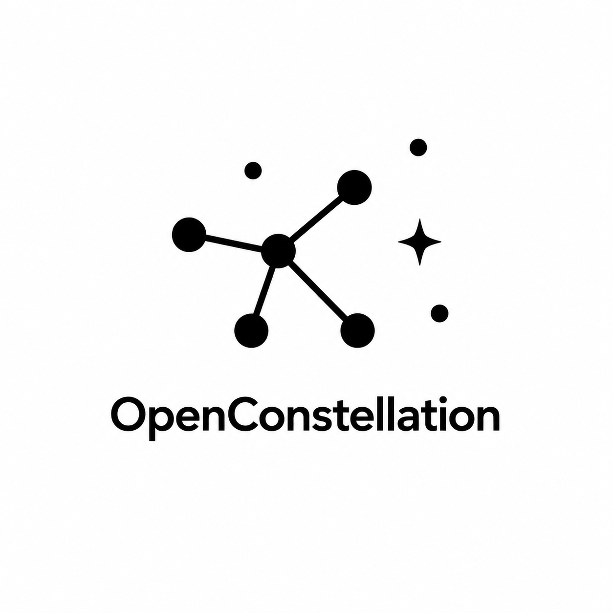
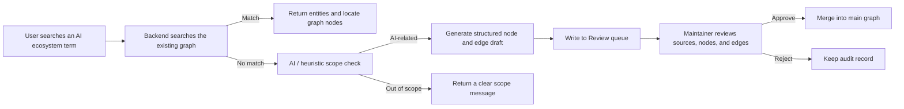

<div align="center">
  <a href="./README.md">中文</a>
  <br><br>
  

  # OpenConstellation 🧭

  ---

  **A unified knowledge graph platform for AI ecosystem research and product intelligence.**

  OpenConstellation organizes companies, models, papers, products, technologies, and open-source projects into an explorable, reviewable, and extensible AI ecosystem map. It is built for researchers, developers, and product teams who need to understand relationships, technical lineage, and source-backed context across the AI landscape.

  <br>

  [](./package.json)
  [](https://react.dev/)
  [](https://www.typescriptlang.org/)
  [](https://vite.dev/)
  [](https://expressjs.com/)
  [](https://api-docs.deepseek.com/)
  [](#license-)
</div>

<br>

> Tip  
> If you only want to run the project quickly, start with Quick Start. This project expects the frontend and backend to run together; without an AI provider key, you can still browse the existing graph, but the app will not silently create unverified AI drafts.

<br>

```text
[Hero Demo Image: show the OpenConstellation graph map, search experience, and review queue]
```

Replace this placeholder with a real product screenshot or an 8-12 second demo GIF that shows the path from searching an AI entity, to locating a graph node, to reviewing an import batch.

<br>

## Overview 🧭

OpenConstellation is an AI ecosystem knowledge graph application that connects AI companies, models, papers, products, people, technologies, and open-source projects through an interactive map. It is not a general encyclopedia or a generic search page; it is a visual workspace for understanding relationships in the AI ecosystem.

The current project includes a React frontend, an Express backend, JSON-backed local storage, DeepSeek/OpenAI-compatible AI integration, and a review-first import workflow. Users can explore the graph, search entities, inspect node details, follow timelines, browse the technology tree, and route AI-generated or GitHub-imported data through review before it becomes part of the main graph.

<br>

## Why this exists 💡

The AI ecosystem moves too quickly for flat lists or scattered notes to explain who built what, which tools depend on which ideas, which products compete, and which technologies came from which research. OpenConstellation turns those relationships into a map that can be explored, sourced, and maintained over time.

It focuses on three principles:

- **Relationships first**: the graph records not only entity names, but also creation, dependency, competition, acquisition, inspiration, and integration relationships.
- **Auditable sources**: nodes, edges, and import batches keep source metadata so the graph does not become an opaque knowledge box.
- **Careful AI assistance**: AI can help draft missing entities, but drafts enter the Review queue first and only reach the main graph after approval.

<br>

## Key Features ✨

- **Interactive AI ecosystem graph**: browse nodes and relationships on the main canvas, with filters for type, relationship, popularity, and category.
- **Scope-aware search**: existing entities return graph results; missing AI-related terms create reviewable drafts; non-AI terms receive a clear scope message.
- **Node detail pages**: inspect descriptions, relationship context, sources, timeline events, and AI-assisted summaries in one place.
- **Review queue**: AI drafts, JSON imports, and GitHub repository imports are grouped into batches for approval or rejection.
- **Source and import tracking**: source records, import batches, review status, trust level, and override records are retained.
- **Multiple exploration views**: Explore, Search, Timeline, Tech Tree, Saved, Review, and About provide different entry points into the same graph.
- **Local-first MVP data layer**: JSON-backed stores keep graph data, source records, user state, and manual overrides easy to inspect during local development.

<br>

## Demo / Screenshots 📸

The repository already includes a brand icon, but real README screenshots have not been committed yet. Recommended assets:

| Scene | Suggested asset | Notes |
| --- | --- | --- |
| Hero Demo | `assets/readme/hero-demo.png` | Show the main graph, top search, and node detail drawer so readers understand the product shape immediately. |
| Search Flow | `assets/readme/search-flow.gif` | Record searching `OpenAI`, locating the node, then searching a missing AI-related term and opening the Review queue. |
| Review Queue | `assets/readme/review-queue.png` | Show GitHub import, batch list, source registry, and approve/reject controls. |
| Architecture | `assets/readme/architecture.png` | Show the data flow across Frontend, API Server, AI Provider, JSON Stores, and Review Gate. |

Placeholder:

```text
[Hero Demo Image: show the OpenConstellation graph map, search experience, and review queue]
```

<br>

## How it works ⚙️

OpenConstellation is built around one core loop: search -> scope check -> draft generation -> human review -> graph merge.



Inputs can be existing entity names, new AI-related concepts, GitHub repository names, or JSON import payloads. Outputs are explorable graph results, reviewable import batches, or explicit scope/provider status messages.

<br>

## Quick Start 🚀

### 1. Install dependencies

```bash
npm install
```

### 2. Configure environment variables

Copy `.env.example` to `.env`, then fill in the DeepSeek or OpenAI-compatible provider settings.

```bash
DEEPSEEK_API_KEY="YOUR_DEEPSEEK_API_KEY"
DEEPSEEK_BASE_URL="https://api.deepseek.com"
DEEPSEEK_MODEL="deepseek-v4-flash"
API_PORT="3001"
API_PROXY_TARGET="http://localhost:3001"
```

### 3. Start the backend

```bash
npm run dev:api
```

### 4. Start the frontend

Open another terminal:

```bash
npm run dev
```

### 5. Open the app

```text
http://localhost:3000
```

Vite proxies `/api/*` requests to the default backend target:

```text
http://localhost:3001
```

<br>

## Usage 🛠️

### Explore the graph

Open the home page or `/explore` to browse AI ecosystem nodes on the main canvas. Click a node to open the detail drawer, and use the filter panel to narrow the view by entity type, relationship, popularity, or category.

### Search an entity

Use the top search bar:

```text
OpenAI
```

If the graph contains a matching entity, the app returns results and can locate the node on the map. If the term is missing but AI-related, the backend checks scope first and then creates a reviewable draft.

### Review imports

Open `/review` to inspect pending, approved, and rejected batches, source status, and imported content. Maintainers can approve a batch and merge it into the main graph, or reject it with notes while keeping an audit trail.

### Create a draft from GitHub

In the Review page, enter a repository name:

```text
huggingface/transformers
```

The system reads GitHub repository metadata and creates a pending graph node. It does not automatically enter the main graph.

<br>

## Configuration 🧰

| Variable | Default | Required | Description |
| --- | --- | --- | --- |
| `DEEPSEEK_API_KEY` | `YOUR_DEEPSEEK_API_KEY` | Required for AI drafts | DeepSeek API key. Takes priority over OpenAI-compatible aliases. |
| `DEEPSEEK_BASE_URL` | `https://api.deepseek.com` | No | DeepSeek OpenAI-compatible API base URL. |
| `DEEPSEEK_MODEL` | `deepseek-v4-flash` | No | Model used for scope checks, summaries, and draft generation. |
| `OPENAI_API_KEY` | empty | Optional | OpenAI-compatible provider key; used only when DeepSeek key is not configured. |
| `OPENAI_BASE_URL` | `https://api.deepseek.com` | Optional | OpenAI-compatible provider base URL. |
| `OPENAI_MODEL` | `deepseek-v4-flash` | Optional | OpenAI-compatible provider model name. |
| `API_PORT` | `3001` | No | Local Express API port. |
| `API_PROXY_TARGET` | `http://localhost:3001` | No | Vite development proxy target. |
| `APP_URL` | `MY_APP_URL` | Optional | Placeholder for the deployed application URL. |

<br>

## Architecture 🧩

```text
OpenConstellation
├── src/                         React frontend
│   ├── components/              Graph, search, review, timeline, tech tree
│   ├── api.ts                   Frontend API client
│   ├── store.ts                 Zustand client state
│   └── types.ts                 Shared graph-facing types
├── server/                      Express backend
│   ├── index.ts                 API server entry
│   ├── app.ts                   App composition and route mounting
│   ├── routes/                  Graph, AI, user, admin, health routes
│   ├── services/                DeepSeek/OpenAI-compatible AI helpers
│   └── data/                    JSON-backed graph/source/user stores
├── scripts/                     Seed and smoke-test scripts
├── public/assets/logo.png       Browser/public logo
├── assets/logo.png              README and repository logo
└── TASKS.md                     Implementation task notes
```

| Layer | Tools |
| --- | --- |
| Frontend | React 19, React Router, Vite, TypeScript |
| Styling | Tailwind CSS 4 |
| Graph | D3 |
| UI / Motion | lucide-react, motion |
| State | Zustand |
| Backend | Express, TypeScript, tsx |
| AI Provider | DeepSeek / OpenAI-compatible Chat Completions API |
| Persistence | JSON-backed local stores |
| Validation | TypeScript check, Vite build, API smoke script |

<br>

## Roadmap 🗺️

- Add real product screenshots, an architecture diagram, and a short GIF so the README feels like a complete open-source product page.
- Improve the Review queue with clearer diff views and duplicate entity detection.
- Connect more reliable external source extraction and source trust evaluation.
- Add graph snapshot export, versioning, and rollback capabilities.
- Upgrade the JSON-backed store to an optional persistent database for collaboration or deployed environments.
- Add a license, maintainer details, and a formal contribution guide.

<br>

## FAQ ❓

### Can this project be used as a general search engine?

No. OpenConstellation focuses on AI ecosystem knowledge. Generic consumer topics, weather, animals, entertainment figures, and other non-AI terms are treated as out of scope.

### Can it run without an API key?

Yes, you can browse the existing graph and basic pages. AI scope checks, AI summaries, and missing-entity draft generation depend on provider configuration.

### Does AI-generated content go directly into the graph?

No. AI-generated output enters the Review queue first and only merges into the main graph after maintainer approval.

### How should I run commands on Windows?

If PowerShell cannot resolve `npm`, use `npm.cmd` explicitly:

```powershell
npm.cmd run dev:api
npm.cmd run dev
```

### How do I verify the project?

```bash
npm run lint
npm run build
npm run smoke:api
```

`smoke:api` requires the backend service to be available and may depend on local API key and network availability.

<br>

## Contributing 🤝

Contributions are welcome around data quality, interaction design, README assets, tests, and documentation. A minimal flow:

1. Open an issue describing the bug, improvement, or data addition.
2. Run `npm run lint` and `npm run build` locally.
3. If the change touches API behavior, add or run `npm run smoke:api`.
4. Open a PR with source links, review impact, and verification notes.

Graph data contributions should include source links whenever possible. AI-generated content should remain reviewable and must not bypass the Review workflow.

<br>

## License 📄

This repository does not currently declare a license.

```text
[License]
```

Before public distribution, external contributions, or production use, add an explicit open-source license file.

<br>

## Contact 📬

```text
[Maintainer]
[Project Website]
[Documentation]
[Community]
```

This README does not invent email addresses, websites, or community links. Add maintainable contact and documentation links before a formal release.
