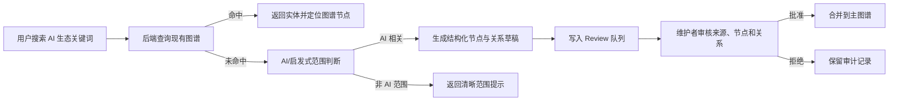

<div align="center">
  <a href="./README.en.md">English</a>
  <br><br>
  

  # OpenConstellation 🧭

  ---

  **面向 AI 生态研究与产品观察的统一知识图谱平台。**

  OpenConstellation 将公司、模型、论文、产品、技术和开源项目组织成一张可探索、可审核、可持续扩展的 AI 生态星图。它适合需要追踪 AI 产业关系、技术脉络和信息来源的研究者、开发者与产品团队。

  <br>

  [](./package.json)
  [](https://react.dev/)
  [](https://www.typescriptlang.org/)
  [](https://vite.dev/)
  [](https://expressjs.com/)
  [](https://api-docs.deepseek.com/)
  [](#许可证-)
</div>

<br>

> Tip  
> 如果你只想最快运行项目，请直接查看「快速开始」。本项目需要前端与后端同时启动；缺少 AI Provider Key 时仍可浏览已有图谱，但不会静默生成未经确认的 AI 草稿。

<br>

```text
[Hero Demo Image: show the OpenConstellation graph map, search experience, and review queue]
```

建议将这里替换为真实产品截图或 8-12 秒演示 GIF，展示从搜索 AI 实体到定位图谱节点、再进入 Review 队列的核心路径。

<br>

## 项目概览 🧭

OpenConstellation 是一个 AI 生态知识图谱应用，用交互式图谱连接 AI 公司、模型、论文、产品、人物、技术与开源项目。它不是通用百科，也不是普通搜索页，而是为 AI 生态关系梳理而设计的可视化工作台。

项目当前包含 React 前端、Express 后端、JSON 本地数据存储、DeepSeek/OpenAI-compatible AI 接口，以及一套先审核再入库的数据导入流程。用户可以浏览图谱、搜索实体、查看节点详情、追踪时间线、查看技术树，并将 AI 生成或 GitHub 导入的数据先送入 Review 队列。

<br>

## 为什么做这个 💡

AI 生态变化太快，单纯的列表或文档很难解释“谁创造了什么、什么依赖什么、哪些产品互相竞争、哪些技术来自哪些研究”。OpenConstellation 试图把这些关系变成一张可以探索、可以溯源、可以逐步维护的图。

它尤其关注三件事：

- **关系优先**：不仅记录实体名称，也记录创建、依赖、竞争、收购、启发、集成等关系。
- **来源可审计**：节点、边和导入批次都保留来源信息，避免图谱变成无法追溯的黑箱。
- **谨慎使用 AI**：AI 可以帮助生成缺失实体草稿，但草稿必须先进入 Review 队列，只有审批后才会写入主图谱。

<br>

## 核心功能 ✨

- **交互式 AI 生态图谱**：在主画布中浏览节点和关系，并按类型、关系、热度和分类过滤视图。
- **语义明确的搜索体验**：已有实体直接返回结果；缺失但属于 AI 生态的关键词会创建待审核草稿；非 AI 关键词会得到范围提示。
- **节点详情页**：集中展示实体描述、关系上下文、来源、时间事件和 AI 辅助摘要。
- **Review 队列**：AI 草稿、JSON 导入和 GitHub 仓库导入都先进入批次审核，再由维护者批准或拒绝。
- **来源与导入追踪**：保留 source、import batch、review status、trust level 和 override 记录。
- **多视角浏览**：提供 Explore、Search、Timeline、Tech Tree、Saved、Review、About 等页面。
- **本地优先的 MVP 数据层**：使用 JSON-backed store 保存图谱、来源、用户状态和人工覆盖记录，便于本地迭代。

<br>

## 效果展示 📸

当前仓库已有品牌图标，但还没有提交真实 README 截图。建议按以下位置补齐素材：

| 场景 | 建议图片 | 说明 |
| --- | --- | --- |
| Hero Demo | `assets/readme/hero-demo.png` | 展示主图谱、顶部搜索和节点详情抽屉，让读者第一眼知道产品形态。 |
| Search Flow | `assets/readme/search-flow.gif` | 录制搜索 `OpenAI`、定位节点、搜索缺失 AI 关键词并进入 Review 的流程。 |
| Review Queue | `assets/readme/review-queue.png` | 展示 GitHub import、批次列表、source registry 和 approve/reject 操作区。 |
| Architecture | `assets/readme/architecture.png` | 展示 Frontend、API Server、AI Provider、JSON Stores 和 Review Gate 的数据流。 |

占位符：

```text
[Hero Demo Image: show the OpenConstellation graph map, search experience, and review queue]
```

<br>

## 工作原理 ⚙️

OpenConstellation 的核心链路是“搜索 -> 判断范围 -> 生成草稿 -> 人工审核 -> 合并图谱”。



输入可以是已有实体名称、AI 相关新概念、GitHub 仓库名或 JSON 导入数据。输出则是可浏览的图谱结果、待审核导入批次，或明确的范围/Provider 状态提示。

<br>

## 快速开始 🚀

### 1. 安装依赖

```bash
npm install
```

### 2. 配置环境变量

复制 `.env.example` 为 `.env`，并填入 DeepSeek 或 OpenAI-compatible Provider 配置。

```bash
DEEPSEEK_API_KEY="YOUR_DEEPSEEK_API_KEY"
DEEPSEEK_BASE_URL="https://api.deepseek.com"
DEEPSEEK_MODEL="deepseek-v4-flash"
API_PORT="3001"
API_PROXY_TARGET="http://localhost:3001"
```

### 3. 启动后端

```bash
npm run dev:api
```

### 4. 启动前端

另开一个终端：

```bash
npm run dev
```

### 5. 打开应用

```text
http://localhost:3000
```

Vite 会将 `/api/*` 请求代理到默认后端地址：

```text
http://localhost:3001
```

<br>

## 使用方式 🛠️

### 浏览图谱

打开首页或 `/explore`，在主画布中查看 AI 生态节点。点击节点可打开详情抽屉，使用筛选面板可以按实体类型、关系、热度或分类缩小范围。

### 搜索实体

在顶部搜索框输入：

```text
OpenAI
```

如果命中已有实体，系统会返回结果并支持定位到图谱节点。如果搜索一个缺失但 AI 相关的关键词，后端会先判断范围，再生成待审核草稿。

### 审核导入

进入 `/review`，可以查看 pending/approved/rejected 批次、来源状态和导入内容。维护者可以批准批次并合并到主图谱，也可以写入拒绝说明并保留审计记录。

### 从 GitHub 创建草稿

在 Review 页面输入仓库名：

```text
huggingface/transformers
```

系统会读取 GitHub 仓库元数据，生成一个待审核图谱节点。该节点不会自动进入主图谱。

<br>

## 配置说明 🧰

| 配置项 | 默认值 | 是否必填 | 说明 |
| --- | --- | --- | --- |
| `DEEPSEEK_API_KEY` | `YOUR_DEEPSEEK_API_KEY` | 生成 AI 草稿时必填 | DeepSeek API Key，优先级高于 OpenAI-compatible aliases。 |
| `DEEPSEEK_BASE_URL` | `https://api.deepseek.com` | 否 | DeepSeek OpenAI-compatible API 地址。 |
| `DEEPSEEK_MODEL` | `deepseek-v4-flash` | 否 | 用于范围判断、摘要和草稿生成的模型名。 |
| `OPENAI_API_KEY` | 空 | 可选 | OpenAI-compatible Provider Key；仅在未配置 DeepSeek Key 时使用。 |
| `OPENAI_BASE_URL` | `https://api.deepseek.com` | 可选 | OpenAI-compatible Provider Base URL。 |
| `OPENAI_MODEL` | `deepseek-v4-flash` | 可选 | OpenAI-compatible Provider 模型名。 |
| `API_PORT` | `3001` | 否 | 本地 Express API 端口。 |
| `API_PROXY_TARGET` | `http://localhost:3001` | 否 | Vite 开发代理目标。 |
| `APP_URL` | `MY_APP_URL` | 可选 | 部署后应用访问地址占位。 |

<br>

## 技术架构 🧩

```text
OpenConstellation
├── src/                         React frontend
│   ├── components/              Graph, search, review, timeline, tech tree
│   ├── api.ts                   Frontend API client
│   ├── store.ts                 Zustand client state
│   └── types.ts                 Shared graph-facing types
├── server/                      Express backend
│   ├── index.ts                 API server entry
│   ├── app.ts                   App composition and route mounting
│   ├── routes/                  Graph, AI, user, admin, health routes
│   ├── services/                DeepSeek/OpenAI-compatible AI helpers
│   └── data/                    JSON-backed graph/source/user stores
├── scripts/                     Seed and smoke-test scripts
├── public/assets/logo.png       Browser/public logo
├── assets/logo.png              README and repository logo
└── TASKS.md                     Implementation task notes
```

| 层级 | 技术 |
| --- | --- |
| Frontend | React 19, React Router, Vite, TypeScript |
| Styling | Tailwind CSS 4 |
| Graph | D3 |
| UI / Motion | lucide-react, motion |
| State | Zustand |
| Backend | Express, TypeScript, tsx |
| AI Provider | DeepSeek / OpenAI-compatible Chat Completions API |
| Persistence | JSON-backed local stores |
| Validation | TypeScript check, Vite build, API smoke script |

<br>

## 路线图 🗺️

- 完善真实产品截图、架构图和短 GIF，让 README 更接近完整开源产品页。
- 为 Review 队列增加更清晰的 diff 视图和重复实体检测。
- 接入更稳定的外部来源抓取与来源可信度评估。
- 增加图谱快照导出、版本管理和数据回滚能力。
- 将 JSON-backed store 升级为可选持久化数据库，用于多人协作或部署环境。
- 补充许可证、维护者信息和正式贡献规范。

<br>

## 常见问题 ❓

### 这个项目能当通用搜索引擎用吗？

不能。OpenConstellation 聚焦 AI 生态知识，普通消费话题、天气、动物、娱乐人物等非 AI 关键词会被判定为范围外。

### 没有配置 API Key 可以运行吗？

可以浏览已有图谱和基础页面。但 AI 范围判断、AI 摘要、缺失实体草稿生成等能力依赖 Provider 配置。

### AI 生成的内容会直接写入图谱吗？

不会。AI 生成结果会进入 Review 队列，只有被维护者批准后才会合并到主图谱。

### Windows 下命令怎么运行？

如果 PowerShell 找不到 `npm`，可以显式使用：

```powershell
npm.cmd run dev:api
npm.cmd run dev
```

### 如何验证项目状态？

```bash
npm run lint
npm run build
npm run smoke:api
```

`smoke:api` 需要后端服务可用，并可能受本地 API Key 与网络状态影响。

<br>

## 贡献指南 🤝

欢迎围绕数据质量、交互体验、README 素材、测试和文档提出贡献。建议的最小流程：

1. 创建 issue，说明你要修复的问题或补充的数据。
2. 本地运行 `npm run lint` 和 `npm run build`。
3. 如果涉及 API 行为，补充或运行 `npm run smoke:api`。
4. 提交 PR，并说明数据来源、Review 影响和验证结果。

涉及图谱数据的贡献应尽量附带来源链接；AI 生成内容必须保留待审核状态，不应直接绕过 Review 流程。

<br>

## 许可证 📄

当前仓库尚未声明许可证。

```text
[License]
```

在公开分发、接受外部贡献或用于生产环境前，建议补充明确的开源许可证文件。

<br>

## 维护者信息 📬

```text
[Maintainer]
[Project Website]
[Documentation]
[Community]
```

当前 README 不编造邮箱、网站或社区入口。请在项目正式发布前补充可维护的联系与文档链接。
